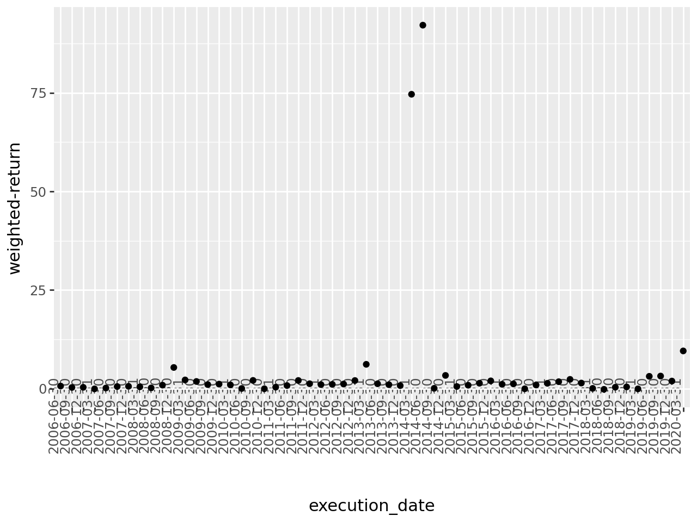

## Module 5: Analyse, diagnose and improve a model​

In the excercise of this week you will be working with financial data in order to (hopefully) find a portfolio of equities which outperform SP500. The data that you are gonna work with has two main sources: 
* Financial data from the companies extracted from the quarterly company reports (mostly extracted from [macrotrends](https://www.macrotrends.net/) so you can use this website to understand better the data and get insights on the features, for example [this](https://www.macrotrends.net/stocks/charts/AAPL/apple/revenue) is the one corresponding to APPLE)
* Stock prices, mostly extracted from [morningstar](https://indexes.morningstar.com/page/morningstar-indexes-empowering-investor-success?utm_source=google&utm_medium=cpc&utm_campaign=MORNI%3AG%3ASearch%3ABrand%3ACore%3AUK%20MORNI%3ABrand%3ACore%3ABroad&utm_content=engine%3Agoogle%7Ccampaignid%3A18471962329%7Cadid%3A625249340069&utm_term=morningstar%20index&gclid=CjwKCAjws9ipBhB1EiwAccEi1Fu6i20XHVcxFxuSEtJGF0If-kq5-uKnZ3rov3eRkXXFfI5j8QBtBBoCayEQAvD_BwE), which basically tell us how the stock price is evolving so we can use it both as past features and the target to predict).

Before going to the problem that we want to solve, let's comment some of the columns of the dataset:


* `Ticker`: a [short name](https://en.wikipedia.org/wiki/Ticker_symbol) to identify the equity (that you can use to search in macrotrends)
* `date`: the date of the company report (normally we are gonna have 1 every quarter). This is for informative purposes but you can ignore it when modeling.
* `execution date`: the date when we would had executed the algorithm for that equity. We want to execute the algorithm once per quarter to create the portfolio, but the release `date`s of all the different company reports don't always match for the quarter, so we just take a common `execution_date` for all of them.
* `stock_change_div_365`: what is the % change of the stock price (with dividens) in the FOLLOWING year after `execution date`. 
* `sp500_change_365`: what is the % change of the SP500 in the FOLLOWING year after `execution date`.
* `close_0`: what is the price at the moment of `execution date`
* `stock_change__minus_120` what is the % change of the stock price in the last 120 days
* `stock_change__minus_730`: what is the % change of the stock price in the last 730 days

The rest of the features can be divided beteween financial features (the ones coming from the reports) and technical features (coming from the stock price). We leave the technical features here as a reference: 


```python
technical_features = ['close_0', 'close_sp500_0', 'close_365', 'close_sp500_365',
       'close__minus_120', 'close_sp500__minus_120', 'close__minus_365',
       'close_sp500__minus_365', 'close__minus_730', 'close_sp500__minus_730',
       'stock_change_365','stock_change_div_365', 'sp500_change_365', 'stock_change__minus_120',
       'sp500_change__minus_120', 'stock_change__minus_365',
       'sp500_change__minus_365', 'stock_change__minus_730','sp500_change__minus_730',
       'std__minus_365','std__minus_730','std__minus_120']
```

The problem that we want to solve is basically find a portfolio of `top_n` tickers (initially set to 10) to invest every `execution date` (basically once per quarter) and the goal is to have a better return than `SP500` in the following year. The initial way to model this is to have a binary target which is 1 when `stock_change_div_365` - `sp500_change_365` (the difference between the return of the equity and the SP500 in the following year) is positive or 0 otherwise. So we try to predict the probability of an equity of improving SP500 in the following year, we take the `top_n` equities and compute their final return.


```python
#!poetry add lightgbm
```


```python
#!poetry add pyarrow
```


```python
#!poetry add shap
```


```python
import pandas as pd
import re
import numpy as np
import lightgbm as lgb
from plotnine import ggplot, geom_histogram, aes, geom_col, coord_flip,geom_bar,scale_x_discrete, geom_point, theme,element_text
import shap
```

    /home/raul/Documentos/zrive-ds/.venv/lib/python3.11/site-packages/tqdm/auto.py:21: TqdmWarning: IProgress not found. Please update jupyter and ipywidgets. See https://ipywidgets.readthedocs.io/en/stable/user_install.html


```python
# number of trees in lightgbm
n_trees = 40
minimum_number_of_tickers = 1500
# Number of the quarters in the past to train
n_train_quarters = 36
# number of tickers to make the portfolio
top_n = 10
```


```python
data_set = pd.read_feather("/home/raul/Documentos/zrive-ds/Datos/financials_against_return.feather")
```

Remove these quarters which have les than `minimum_number_of_tickers` tickers:


```python
df_quarter_lengths = data_set.groupby(["execution_date"]).size().reset_index().rename(columns = {0:"count"})
data_set = pd.merge(data_set, df_quarter_lengths, on = ["execution_date"])
data_set = data_set[data_set["count"]>=minimum_number_of_tickers]
```


```python
data_set.shape
```


    (170483, 145)


Create the target:


```python
data_set["diff_ch_sp500"] = data_set["stock_change_div_365"] - data_set["sp500_change_365"]

data_set.loc[data_set["diff_ch_sp500"]>0,"target"] = 1
data_set.loc[data_set["diff_ch_sp500"]<0,"target"] = 0

data_set["target"].value_counts()
```


    target
    0.0    82437
    1.0    73829
    Name: count, dtype: int64


This function computes the main metric that we want to optimize: given a prediction where we have probabilities for each equity, we sort the equities in descending order of probability, we pick the `top_n` ones, and we we weight the returned `diff_ch_sp500` by the probability:


```python
def get_weighted_performance_of_stocks(df,metric):
    df["norm_prob"] = 1/len(df)
    return np.sum(df["norm_prob"]*df[metric])

def get_top_tickers_per_prob(preds):
    if len(preds) == len(train_set):
        data_set = train_set.copy()
    elif len(preds) == len(test_set):
        data_set = test_set.copy()
    else:
        assert ("Not matching train/test")
    data_set["prob"] = preds
    data_set = data_set.sort_values(["prob"], ascending = False)
    data_set = data_set.head(top_n)
    return data_set

# main metric to evaluate: average diff_ch_sp500 of the top_n stocks
def top_wt_performance(preds, train_data):
    top_dataset = get_top_tickers_per_prob(preds)
    return "weighted-return", get_weighted_performance_of_stocks(top_dataset,"diff_ch_sp500"), True
```

We have created for you a function to make the `train` and `test` split based on a `execution_date`:


```python
def split_train_test_by_period(data_set, test_execution_date,include_nulls_in_test = False):
    # we train with everything happening at least one year before the test execution date
    train_set = data_set.loc[data_set["execution_date"] <= pd.to_datetime(test_execution_date) - pd.Timedelta(350, unit = "day")]
    # remove those rows where the target is null
    train_set = train_set[~pd.isna(train_set["diff_ch_sp500"])]
    execution_dates = train_set.sort_values("execution_date")["execution_date"].unique()
    # Pick only the last n_train_quarters
    if n_train_quarters!=None:
        train_set = train_set[train_set["execution_date"].isin(execution_dates[-n_train_quarters:])]
        
    # the test set are the rows happening in the execution date with the concrete frequency
    test_set = data_set.loc[(data_set["execution_date"] == test_execution_date)]
    if not include_nulls_in_test:
        test_set = test_set[~pd.isna(test_set["diff_ch_sp500"])]
    test_set = test_set.sort_values('date', ascending = False).drop_duplicates('Ticker', keep = 'first')
    
    return train_set, test_set
```

Ensure that we don't include features which are irrelevant or related to the target:


```python
def get_columns_to_remove():
    columns_to_remove = [
                         "date",
                         "improve_sp500",
                         "Ticker",
                         "freq",
                         "set",
                         "close_sp500_365",
                         "close_365",
                         "stock_change_365",
                         "sp500_change_365",
                         "stock_change_div_365",
                         "stock_change_730",
                         "sp500_change_365",
                         "stock_change_div_730",
                         "diff_ch_sp500",
                         "diff_ch_avg_500",
                         "execution_date","target","index","quarter","std_730","count"]
        
    return columns_to_remove
```

This is the main modeling function, it receives a train test and a test set and trains a `lightgbm` in classification mode. We don't recommend to change the main algorithm for this excercise but we suggest to play with its hyperparameters:


```python
import warnings
warnings.filterwarnings('ignore')


def train_model(train_set,test_set,n_estimators = 300):

    columns_to_remove = get_columns_to_remove()
    
    X_train = train_set.drop(columns = columns_to_remove, errors = "ignore")
    X_test = test_set.drop(columns = columns_to_remove, errors = "ignore")
    
    
    y_train = train_set["target"]
    y_test = test_set["target"]

    lgb_train = lgb.Dataset(X_train,y_train)
    lgb_test = lgb.Dataset(X_test, y_test, reference=lgb_train)
    
    eval_result = {}
    
 
    objective = 'binary'
    metric = 'binary_logloss' 
    params = {
             "random_state":2, 
             "verbosity": -1,
             "n_jobs":10, 
             "n_estimators":n_estimators,
             "objective": objective,
             "metric": metric}
    
    model = lgb.train(params = params,train_set = lgb_train,
                      valid_sets = [lgb_test,lgb_train],
                      feval = [top_wt_performance],
                      callbacks = [lgb.record_evaluation(eval_result = eval_result)])
    return model,eval_result,X_train,X_test


 
            
```

This is the function which receives an `execution_date` and splits the dataset between train and test, trains the models and evaluates the model in test. It returns a dictionary with the different evaluation metrics in train and test:

Meto en la funcion que me devuelva los shap values


```python
import shap
def run_model_for_execution_date(execution_date,all_results,all_predicted_tickers_list,all_models,n_estimators,include_nulls_in_test = False):
        global train_set
        global test_set
        # split the dataset between train and test
        train_set, test_set = split_train_test_by_period(data_set,execution_date,include_nulls_in_test = include_nulls_in_test)
        train_size, _ = train_set.shape
        test_size, _ = test_set.shape
        model = None
        X_train = None
        X_test = None
        shap_values = None
        # if both train and test are not empty
        if train_size > 0 and test_size>0:
            model, evals_result, X_train, X_test = train_model(train_set,
                                                              test_set,
                                                              n_estimators = n_estimators)
            
            test_set['prob'] = model.predict(X_test)
            predicted_tickers = test_set.sort_values('prob', ascending = False)
            predicted_tickers["execution_date"] = execution_date
            all_results[(execution_date)] = evals_result
            all_models[(execution_date)] = model
            all_predicted_tickers_list.append(predicted_tickers)
            explainer = shap.Explainer(model)
            shap_values = explainer(X_test)
        return all_results,all_predicted_tickers_list,all_models,model,X_train,X_test, shap_values


execution_dates = np.sort( data_set['execution_date'].unique() )

```

This is the main training loop: it goes through each different `execution_date` and calls `run_model_for_execution_date`. All the results are stored in `all_results` and the predictions in `all_predicted_tickers_list`.


```python
execution_dates1quarter=np.random.choice(execution_dates, size=(len(execution_dates)//4), replace=False)
```


```python
all_results = {}
all_predicted_tickers_list = []
all_models = {}
shap_values_list = []
# Acumular importancias de variables
feature_importances = []
for execution_date in execution_dates:
    print(execution_date)
    all_results,all_predicted_tickers_list,all_models,model,X_train,X_test, shap_values = run_model_for_execution_date(execution_date,all_results,all_predicted_tickers_list,all_models,n_trees,False)
    if shap_values is not None:
        shap_values_list.append(shap_values.values)
        feature_importances.append(np.abs(shap_values.values).mean(axis=0))
    else:
        print(f"Skipping SHAP values for execution date {execution_date} due to calculation error")
all_predicted_tickers = pd.concat(all_predicted_tickers_list) 
```

    2005-06-30T00:00:00.000000000
    Skipping SHAP values for execution date 2005-06-30T00:00:00.000000000 due to calculation error
    2005-09-30T00:00:00.000000000
    Skipping SHAP values for execution date 2005-09-30T00:00:00.000000000 due to calculation error
    2005-12-30T00:00:00.000000000
    Skipping SHAP values for execution date 2005-12-30T00:00:00.000000000 due to calculation error
    2006-03-31T00:00:00.000000000
    Skipping SHAP values for execution date 2006-03-31T00:00:00.000000000 due to calculation error
    2006-06-30T00:00:00.000000000
    2006-09-30T00:00:00.000000000
    2006-12-30T00:00:00.000000000
    2007-03-31T00:00:00.000000000
    2007-06-30T00:00:00.000000000
    2007-09-30T00:00:00.000000000
    2007-12-30T00:00:00.000000000
    2008-03-31T00:00:00.000000000
    2008-06-30T00:00:00.000000000
    2008-09-30T00:00:00.000000000
    2008-12-30T00:00:00.000000000
    2009-03-31T00:00:00.000000000
    2009-06-30T00:00:00.000000000
    2009-09-30T00:00:00.000000000
    2009-12-30T00:00:00.000000000
    2010-03-31T00:00:00.000000000
    2010-06-30T00:00:00.000000000
    2010-09-30T00:00:00.000000000
    2010-12-30T00:00:00.000000000
    2011-03-31T00:00:00.000000000
    2011-06-30T00:00:00.000000000
    2011-09-30T00:00:00.000000000
    2011-12-30T00:00:00.000000000
    2012-03-31T00:00:00.000000000
    2012-06-30T00:00:00.000000000
    2012-09-30T00:00:00.000000000
    2012-12-30T00:00:00.000000000
    2013-03-31T00:00:00.000000000
    2013-06-30T00:00:00.000000000
    2013-09-30T00:00:00.000000000
    2013-12-30T00:00:00.000000000
    2014-03-31T00:00:00.000000000
    2014-06-30T00:00:00.000000000
    2014-09-30T00:00:00.000000000
    2014-12-30T00:00:00.000000000
    2015-03-31T00:00:00.000000000
    2015-06-30T00:00:00.000000000
    2015-09-30T00:00:00.000000000
    2015-12-30T00:00:00.000000000
    2016-03-31T00:00:00.000000000
    2016-06-30T00:00:00.000000000
    2016-09-30T00:00:00.000000000
    2016-12-30T00:00:00.000000000
    2017-03-31T00:00:00.000000000
    2017-06-30T00:00:00.000000000
    2017-09-30T00:00:00.000000000
    2017-12-30T00:00:00.000000000
    2018-03-31T00:00:00.000000000
    2018-06-30T00:00:00.000000000
    2018-09-30T00:00:00.000000000
    2018-12-30T00:00:00.000000000
    2019-03-31T00:00:00.000000000
    2019-06-30T00:00:00.000000000
    2019-09-30T00:00:00.000000000
    2019-12-30T00:00:00.000000000
    2020-03-31T00:00:00.000000000
    2020-06-30T00:00:00.000000000
    Skipping SHAP values for execution date 2020-06-30T00:00:00.000000000 due to calculation error
    2020-09-30T00:00:00.000000000
    Skipping SHAP values for execution date 2020-09-30T00:00:00.000000000 due to calculation error
    2020-12-30T00:00:00.000000000
    Skipping SHAP values for execution date 2020-12-30T00:00:00.000000000 due to calculation error
    2021-03-27T00:00:00.000000000
    Skipping SHAP values for execution date 2021-03-27T00:00:00.000000000 due to calculation error


```python
def parse_results_into_df(set_):
    df = pd.DataFrame()
    for date in all_results:
        df_tmp = pd.DataFrame(all_results[(date)][set_])
        df_tmp["n_trees"] = list(range(len(df_tmp)))
        df_tmp["execution_date"] = date
        df= pd.concat([df,df_tmp])
    
    df["execution_date"] = df["execution_date"].astype(str)
    
    return df
```


```python
test_results = parse_results_into_df("valid_0")
train_results = parse_results_into_df("training")
```


```python
test_results_final_tree = test_results.sort_values(["execution_date","n_trees"]).drop_duplicates("execution_date",keep = "last")
train_results_final_tree = train_results.sort_values(["execution_date","n_trees"]).drop_duplicates("execution_date",keep = "last")

```

And this are the results:


```python
ggplot(test_results_final_tree) + geom_point(aes(x = "execution_date", y = "weighted-return")) + theme(axis_text_x = element_text(angle = 90, vjust = 0.5, hjust=1))


```


    

    


```python
ggplot(train_results_final_tree) + geom_point(aes(x = "execution_date", y = "weighted-return")) + theme(axis_text_x = element_text(angle = 90, vjust = 0.5, hjust=1))

```


    

    


We have trained the first models for all the periods for you, but there are a lot of things which may be wrong or can be improved. Some ideas where you can start:
* Try to see if there is any kind of data leakage or suspicious features
* If the training part is very slow, try to see how you can modify it to execute faster tests
* Try to understand if the algorithm is learning correctly
* We are using a very high level metric to evaluate the algorithm so you maybe need to use some more low level ones
* Try to see if there is overfitting
* Try to see if there is a lot of noise between different trainings
* To simplify, why if you only keep the first tickers in terms of Market Cap?
* Change the number of quarters to train in the past


```python
import matplotlib.pyplot as plt
from sklearn.metrics import roc_curve, roc_auc_score, precision_recall_curve, auc

def plot_metrics(
        model_name, y_pred, y_test, target_precision=0.05, figure=None
):
    precision_, recall_, _ =precision_recall_curve(y_test, y_pred)
    pr_auc = auc(recall_, precision_)
    fpr, tpr, _=roc_curve(y_test, y_pred)
    roc_auc = roc_auc_score(y_test, y_pred)

    if figure is None:
        fig, ax =plt.subplots(1,2,figsize=(14,7))
    else:
        fig, ax =figure

    ax[0].plot(recall_, precision_, label=f"{model_name}; AUC: {pr_auc:.2f}")
    ax[0].set_xlabel("recall")
    ax[0].set_ylabel("precision")
    ax[0].set_title(f"Precision-recall Curve")
    ax[0].legend()


    ax[1].plot(fpr, tpr, label=f"AUC: {roc_auc:.2f}")
    ax[1].set_xlabel("FPR")
    ax[1].set_ylabel("TPR")
    ax[1].set_title(f"ROC Curve")
    ax[1].legend()

```


```python
import shap
def run_model_for_execution_date1(execution_date,all_results,all_predicted_tickers_list,all_models,n_estimators,include_nulls_in_test = False):
        global train_set
        global test_set
        # split the dataset between train and test
        train_set, test_set = split_train_test_by_period(data_set,execution_date,include_nulls_in_test = include_nulls_in_test)
        train_size, _ = train_set.shape
        test_size, _ = test_set.shape
        model = None
        X_train = None
        X_test = None
        shap_values = None
        test_prob = None
        train_prob = None
        # if both train and test are not empty
        if train_size > 0 and test_size>0:
            model, evals_result, X_train, X_test = train_model(train_set,
                                                              test_set,
                                                              n_estimators = n_estimators)
            
            test_set['prob'] = model.predict(X_test)
            test_prob=test_set['prob']
            train_prob = model.predict(X_train)
            predicted_tickers = test_set.sort_values('prob', ascending = False)
            predicted_tickers["execution_date"] = execution_date
            all_results[(execution_date)] = evals_result
            all_models[(execution_date)] = model
            all_predicted_tickers_list.append(predicted_tickers)
            explainer = shap.Explainer(model)
            shap_values = explainer(X_test)

            
        return all_results,all_predicted_tickers_list,all_models,model,X_train,X_test, shap_values, test_prob, test_set['target'], train_prob, train_set['target']


execution_dates = np.sort( data_set['execution_date'].unique() )
```


```python
def get_columns_to_remove():
    columns_to_remove = [
                         "date",
                         "improve_sp500",
                         "Ticker",
                         "freq",
                         "set",
                         "close_sp500_365",
                         "close_365",
                         "stock_change_365",
                         "sp500_change_365",
                         "stock_change_div_365",
                         "stock_change_730",
                         "sp500_change_365",
                         "stock_change_div_730",
                         "diff_ch_sp500",
                         "diff_ch_avg_500",
                         "execution_date","target","index","quarter","std_730","count"]
        
    return columns_to_remove
```


```python
all_results = {}
all_predicted_tickers_list = []
all_models = {}
shap_values_list = []
# Acumular importancias de variables
feature_importances = []
# Crear figuras para los gráficos
fig_train, ax_train = plt.subplots(1, 2, figsize=(14, 7))
fig_train.suptitle("Train Metrics")
fig_val, ax_val = plt.subplots(1, 2, figsize=(14, 7))
fig_val.suptitle("validation Metrics")
for execution_date in execution_dates:
    print(execution_date)
    all_results,all_predicted_tickers_list,all_models,model,X_train,X_test, shap_values, probs_val, y_val, probs_train, y_train= run_model_for_execution_date1(execution_date,all_results,all_predicted_tickers_list,all_models,n_trees,False)
    if ((probs_train is not None) and (probs_val is not None) and (len(probs_train)==len(y_train)) and (len(probs_val)==len(y_val))):
            # Trazar las métricas para X_train
        plot_metrics(f"Modelo={execution_date}, Train", 
                 probs_train, y_train, figure=(fig_train, ax_train))
    
    # Trazar las métricas para X_val
        plot_metrics(f"Modelo={execution_date},- Validation", 
                 probs_val, y_val, figure=(fig_val, ax_val))
    else:
        print(f"Skipping SHAP values for execution date {execution_date} due to calculation error")

    if shap_values is not None:
        shap_values_list.append(shap_values.values)
        feature_importances.append(np.abs(shap_values.values).mean(axis=0))
        
all_predicted_tickers = pd.concat(all_predicted_tickers_list) 
# Ajustar espaciado entre subgráficos
plt.tight_layout()

# Mostrar los gráficos
plt.show()
```

    2005-06-30T00:00:00.000000000
    Skipping SHAP values for execution date 2005-06-30T00:00:00.000000000 due to calculation error
    2005-09-30T00:00:00.000000000
    Skipping SHAP values for execution date 2005-09-30T00:00:00.000000000 due to calculation error
    2005-12-30T00:00:00.000000000
    Skipping SHAP values for execution date 2005-12-30T00:00:00.000000000 due to calculation error
    2006-03-31T00:00:00.000000000
    Skipping SHAP values for execution date 2006-03-31T00:00:00.000000000 due to calculation error
    2006-06-30T00:00:00.000000000
    2006-09-30T00:00:00.000000000
    2006-12-30T00:00:00.000000000
    2007-03-31T00:00:00.000000000
    2007-06-30T00:00:00.000000000
    2007-09-30T00:00:00.000000000
    2007-12-30T00:00:00.000000000
    2008-03-31T00:00:00.000000000
    2008-06-30T00:00:00.000000000
    2008-09-30T00:00:00.000000000
    2008-12-30T00:00:00.000000000
    2009-03-31T00:00:00.000000000
    2009-06-30T00:00:00.000000000
    2009-09-30T00:00:00.000000000
    2009-12-30T00:00:00.000000000
    2010-03-31T00:00:00.000000000
    2010-06-30T00:00:00.000000000
    2010-09-30T00:00:00.000000000
    2010-12-30T00:00:00.000000000
    2011-03-31T00:00:00.000000000
    2011-06-30T00:00:00.000000000
    2011-09-30T00:00:00.000000000
    2011-12-30T00:00:00.000000000
    2012-03-31T00:00:00.000000000
    2012-06-30T00:00:00.000000000
    2012-09-30T00:00:00.000000000
    2012-12-30T00:00:00.000000000
    2013-03-31T00:00:00.000000000
    2013-06-30T00:00:00.000000000
    2013-09-30T00:00:00.000000000
    2013-12-30T00:00:00.000000000
    2014-03-31T00:00:00.000000000
    2014-06-30T00:00:00.000000000
    2014-09-30T00:00:00.000000000
    2014-12-30T00:00:00.000000000
    2015-03-31T00:00:00.000000000
    2015-06-30T00:00:00.000000000
    2015-09-30T00:00:00.000000000
    2015-12-30T00:00:00.000000000
    2016-03-31T00:00:00.000000000
    2016-06-30T00:00:00.000000000
    2016-09-30T00:00:00.000000000
    2016-12-30T00:00:00.000000000
    2017-03-31T00:00:00.000000000
    2017-06-30T00:00:00.000000000
    2017-09-30T00:00:00.000000000
    2017-12-30T00:00:00.000000000
    2018-03-31T00:00:00.000000000
    2018-06-30T00:00:00.000000000
    2018-09-30T00:00:00.000000000
    2018-12-30T00:00:00.000000000
    2019-03-31T00:00:00.000000000
    2019-06-30T00:00:00.000000000
    2019-09-30T00:00:00.000000000
    2019-12-30T00:00:00.000000000
    2020-03-31T00:00:00.000000000
    2020-06-30T00:00:00.000000000
    Skipping SHAP values for execution date 2020-06-30T00:00:00.000000000 due to calculation error
    2020-09-30T00:00:00.000000000
    Skipping SHAP values for execution date 2020-09-30T00:00:00.000000000 due to calculation error
    2020-12-30T00:00:00.000000000
    Skipping SHAP values for execution date 2020-12-30T00:00:00.000000000 due to calculation error
    2021-03-27T00:00:00.000000000
    Skipping SHAP values for execution date 2021-03-27T00:00:00.000000000 due to calculation error


    

    


    

    


    

    


    

    


El modelo esta claramente overfitteado, sobretodo en las primeras fechas ya quee tiene menos datos para los que entrenar


```python
# Calcular la media de las importancias de las variables
mean_feature_importances = np.mean(feature_importances, axis=0)
columns_to_remove = get_columns_to_remove()
    
X_train = train_set.drop(columns = columns_to_remove, errors = "ignore")
# Crear un DataFrame para las importancias de las variables
feature_names = X_train.columns  # Suponiendo que X_train tiene los nombres de las características
importance_df = pd.DataFrame({
    'feature': feature_names,
    'importance': mean_feature_importances
})

# Ordenar por importancia
importance_df = importance_df.sort_values(by='importance', ascending=False)

print(importance_df)
```

                             feature  importance
    87                       close_0    0.216592
    98       sp500_change__minus_730    0.071466
    19                        EBITDA    0.050689
    89              sp500_change_730    0.047723
    88                 close_sp500_0    0.042931
    ..                           ...         ...
    35   NetAcquisitionsDivestitures    0.001251
    129   NetCashFlow_change_2_years    0.001230
    37   NetChangeInIntangibleAssets    0.000838
    53                   OtherIncome    0.000098
    20                  EBITDAMargin    0.000000
    
    [134 rows x 2 columns]


La variable close_0 tiene mas del doble de importnacia que la segunda, probaremos a hacer el modelo sin ella 


```python
def get_columns_to_remove():
    columns_to_remove = [
                         "date",
                         "improve_sp500",
                         "Ticker",
                         "freq",
                         "set",
                         "close_sp500_365",
                         "close_365",
                         "stock_change_365",
                         "sp500_change_365",
                         "stock_change_div_365",
                         "stock_change_730",
                         "sp500_change_365",
                         "stock_change_div_730",
                         "diff_ch_sp500",
                         "diff_ch_avg_500",
                         "execution_date","target","index","quarter","std_730","count", "close_0"]
        
    return columns_to_remove
```


```python
all_results = {}
all_predicted_tickers_list = []
all_models = {}
shap_values_list = []
# Acumular importancias de variables
feature_importances = []
# Crear figuras para los gráficos
fig_train, ax_train = plt.subplots(1, 2, figsize=(14, 7))
fig_train.suptitle("Train Metrics")
fig_val, ax_val = plt.subplots(1, 2, figsize=(14, 7))
fig_val.suptitle("validation Metrics")
for execution_date in execution_dates:
    print(execution_date)
    all_results,all_predicted_tickers_list,all_models,model,X_train,X_test, shap_values, probs_val, y_val, probs_train, y_train= run_model_for_execution_date1(execution_date,all_results,all_predicted_tickers_list,all_models,n_trees,False)
    if ((probs_train is not None) and (probs_val is not None) and (len(probs_train)==len(y_train)) and (len(probs_val)==len(y_val))):
            # Trazar las métricas para X_train
        plot_metrics(f"Modelo={execution_date}, Train", 
                 probs_train, y_train, figure=(fig_train, ax_train))
    
    # Trazar las métricas para X_val
        plot_metrics(f"Modelo={execution_date},- Validation", 
                 probs_val, y_val, figure=(fig_val, ax_val))
    else:
        print(f"Skipping SHAP values for execution date {execution_date} due to calculation error")

    if shap_values is not None:
        shap_values_list.append(shap_values.values)
        feature_importances.append(np.abs(shap_values.values).mean(axis=0))
        
all_predicted_tickers = pd.concat(all_predicted_tickers_list) 
# Ajustar espaciado entre subgráficos
plt.tight_layout()

# Mostrar los gráficos
plt.show()
```

    2005-06-30T00:00:00.000000000
    Skipping SHAP values for execution date 2005-06-30T00:00:00.000000000 due to calculation error
    2005-09-30T00:00:00.000000000
    Skipping SHAP values for execution date 2005-09-30T00:00:00.000000000 due to calculation error
    2005-12-30T00:00:00.000000000
    Skipping SHAP values for execution date 2005-12-30T00:00:00.000000000 due to calculation error
    2006-03-31T00:00:00.000000000
    Skipping SHAP values for execution date 2006-03-31T00:00:00.000000000 due to calculation error
    2006-06-30T00:00:00.000000000
    2006-09-30T00:00:00.000000000
    2006-12-30T00:00:00.000000000
    2007-03-31T00:00:00.000000000
    2007-06-30T00:00:00.000000000
    2007-09-30T00:00:00.000000000
    2007-12-30T00:00:00.000000000
    2008-03-31T00:00:00.000000000
    2008-06-30T00:00:00.000000000
    2008-09-30T00:00:00.000000000
    2008-12-30T00:00:00.000000000
    2009-03-31T00:00:00.000000000
    2009-06-30T00:00:00.000000000
    2009-09-30T00:00:00.000000000
    2009-12-30T00:00:00.000000000
    2010-03-31T00:00:00.000000000
    2010-06-30T00:00:00.000000000
    2010-09-30T00:00:00.000000000
    2010-12-30T00:00:00.000000000
    2011-03-31T00:00:00.000000000
    2011-06-30T00:00:00.000000000
    2011-09-30T00:00:00.000000000
    2011-12-30T00:00:00.000000000
    2012-03-31T00:00:00.000000000
    2012-06-30T00:00:00.000000000
    2012-09-30T00:00:00.000000000
    2012-12-30T00:00:00.000000000
    2013-03-31T00:00:00.000000000
    2013-06-30T00:00:00.000000000
    2013-09-30T00:00:00.000000000
    2013-12-30T00:00:00.000000000
    2014-03-31T00:00:00.000000000
    2014-06-30T00:00:00.000000000
    2014-09-30T00:00:00.000000000
    2014-12-30T00:00:00.000000000
    2015-03-31T00:00:00.000000000
    2015-06-30T00:00:00.000000000
    2015-09-30T00:00:00.000000000
    2015-12-30T00:00:00.000000000
    2016-03-31T00:00:00.000000000
    2016-06-30T00:00:00.000000000
    2016-09-30T00:00:00.000000000
    2016-12-30T00:00:00.000000000
    2017-03-31T00:00:00.000000000
    2017-06-30T00:00:00.000000000
    2017-09-30T00:00:00.000000000
    2017-12-30T00:00:00.000000000
    2018-03-31T00:00:00.000000000
    2018-06-30T00:00:00.000000000
    2018-09-30T00:00:00.000000000
    2018-12-30T00:00:00.000000000
    2019-03-31T00:00:00.000000000
    2019-06-30T00:00:00.000000000
    2019-09-30T00:00:00.000000000
    2019-12-30T00:00:00.000000000
    2020-03-31T00:00:00.000000000
    2020-06-30T00:00:00.000000000
    Skipping SHAP values for execution date 2020-06-30T00:00:00.000000000 due to calculation error
    2020-09-30T00:00:00.000000000
    Skipping SHAP values for execution date 2020-09-30T00:00:00.000000000 due to calculation error
    2020-12-30T00:00:00.000000000
    Skipping SHAP values for execution date 2020-12-30T00:00:00.000000000 due to calculation error
    2021-03-27T00:00:00.000000000
    Skipping SHAP values for execution date 2021-03-27T00:00:00.000000000 due to calculation error


    

    


    

    


    

    


    

    


```python
test_results = parse_results_into_df("valid_0")
train_results = parse_results_into_df("training")
```


```python
test_results_final_tree = test_results.sort_values(["execution_date","n_trees"]).drop_duplicates("execution_date",keep = "last")
train_results_final_tree = train_results.sort_values(["execution_date","n_trees"]).drop_duplicates("execution_date",keep = "last")

```


```python
ggplot(test_results_final_tree) + geom_point(aes(x = "execution_date", y = "weighted-return")) + theme(axis_text_x = element_text(angle = 90, vjust = 0.5, hjust=1))


```


    

    


```python
ggplot(train_results_final_tree) + geom_point(aes(x = "execution_date", y = "weighted-return")) + theme(axis_text_x = element_text(angle = 90, vjust = 0.5, hjust=1))

```


    

    


El rendimiento en validacion es mucho peor sin close_0


```python
# Calcular la media de las importancias de las variables
mean_feature_importances = np.mean(feature_importances, axis=0)
columns_to_remove = get_columns_to_remove()
    
X_train = train_set.drop(columns = columns_to_remove, errors = "ignore")
# Crear un DataFrame para las importancias de las variables
feature_names = X_train.columns  # Suponiendo que X_train tiene los nombres de las características
importance_df = pd.DataFrame({
    'feature': feature_names,
    'importance': mean_feature_importances
})

# Ordenar por importancia
importance_df = importance_df.sort_values(by='importance', ascending=False)

print(importance_df)
```

                            feature  importance
    97      sp500_change__minus_730    0.069060
    87                close_sp500_0    0.067501
    88             sp500_change_730    0.048200
    98               std__minus_120    0.037006
    19                       EBITDA    0.034874
    ..                          ...         ...
    35  NetAcquisitionsDivestitures    0.001156
    44                    NetIncome    0.001116
    37  NetChangeInIntangibleAssets    0.000572
    53                  OtherIncome    0.000243
    20                 EBITDAMargin    0.000000
    
    [133 rows x 2 columns]


Buscamos que observaciones son las que mas influye la variable 'close_0'


```python
def get_columns_to_remove():
    columns_to_remove = [
                         "date",
                         "improve_sp500",
                         "Ticker",
                         "freq",
                         "set",
                         "close_sp500_365",
                         "close_365",
                         "stock_change_365",
                         "sp500_change_365",
                         "stock_change_div_365",
                         "stock_change_730",
                         "sp500_change_365",
                         "stock_change_div_730",
                         "diff_ch_sp500",
                         "diff_ch_avg_500",
                         "execution_date","target","index","quarter","std_730","count"]
        
    return columns_to_remove
```


```python
all_results = {}
all_predicted_tickers_list = []
all_models = {}
shap_values_list = []
# Acumular importancias de variables
feature_importances = []
for execution_date in execution_dates:
    print(execution_date)
    all_results,all_predicted_tickers_list,all_models,model,X_train,X_test, shap_values = run_model_for_execution_date(execution_date,all_results,all_predicted_tickers_list,all_models,n_trees,False)
    if shap_values is not None:
        shap_values_list.append(shap_values.values)
        feature_importances.append(np.abs(shap_values.values).mean(axis=0))
    else:
        print(f"Skipping SHAP values for execution date {execution_date} due to calculation error")
all_predicted_tickers = pd.concat(all_predicted_tickers_list) 
```

    2005-06-30T00:00:00.000000000
    Skipping SHAP values for execution date 2005-06-30T00:00:00.000000000 due to calculation error
    2005-09-30T00:00:00.000000000
    Skipping SHAP values for execution date 2005-09-30T00:00:00.000000000 due to calculation error
    2005-12-30T00:00:00.000000000
    Skipping SHAP values for execution date 2005-12-30T00:00:00.000000000 due to calculation error
    2006-03-31T00:00:00.000000000
    Skipping SHAP values for execution date 2006-03-31T00:00:00.000000000 due to calculation error
    2006-06-30T00:00:00.000000000
    2006-09-30T00:00:00.000000000
    2006-12-30T00:00:00.000000000
    2007-03-31T00:00:00.000000000
    2007-06-30T00:00:00.000000000
    2007-09-30T00:00:00.000000000
    2007-12-30T00:00:00.000000000
    2008-03-31T00:00:00.000000000
    2008-06-30T00:00:00.000000000
    2008-09-30T00:00:00.000000000
    2008-12-30T00:00:00.000000000
    2009-03-31T00:00:00.000000000
    2009-06-30T00:00:00.000000000
    2009-09-30T00:00:00.000000000
    2009-12-30T00:00:00.000000000
    2010-03-31T00:00:00.000000000
    2010-06-30T00:00:00.000000000
    2010-09-30T00:00:00.000000000
    2010-12-30T00:00:00.000000000
    2011-03-31T00:00:00.000000000
    2011-06-30T00:00:00.000000000
    2011-09-30T00:00:00.000000000
    2011-12-30T00:00:00.000000000
    2012-03-31T00:00:00.000000000
    2012-06-30T00:00:00.000000000
    2012-09-30T00:00:00.000000000
    2012-12-30T00:00:00.000000000
    2013-03-31T00:00:00.000000000
    2013-06-30T00:00:00.000000000
    2013-09-30T00:00:00.000000000
    2013-12-30T00:00:00.000000000
    2014-03-31T00:00:00.000000000
    2014-06-30T00:00:00.000000000
    2014-09-30T00:00:00.000000000
    2014-12-30T00:00:00.000000000
    2015-03-31T00:00:00.000000000
    2015-06-30T00:00:00.000000000
    2015-09-30T00:00:00.000000000
    2015-12-30T00:00:00.000000000
    2016-03-31T00:00:00.000000000
    2016-06-30T00:00:00.000000000
    2016-09-30T00:00:00.000000000
    2016-12-30T00:00:00.000000000
    2017-03-31T00:00:00.000000000
    2017-06-30T00:00:00.000000000
    2017-09-30T00:00:00.000000000
    2017-12-30T00:00:00.000000000
    2018-03-31T00:00:00.000000000
    2018-06-30T00:00:00.000000000
    2018-09-30T00:00:00.000000000
    2018-12-30T00:00:00.000000000
    2019-03-31T00:00:00.000000000
    2019-06-30T00:00:00.000000000
    2019-09-30T00:00:00.000000000
    2019-12-30T00:00:00.000000000
    2020-03-31T00:00:00.000000000
    2020-06-30T00:00:00.000000000
    Skipping SHAP values for execution date 2020-06-30T00:00:00.000000000 due to calculation error
    2020-09-30T00:00:00.000000000
    Skipping SHAP values for execution date 2020-09-30T00:00:00.000000000 due to calculation error
    2020-12-30T00:00:00.000000000
    Skipping SHAP values for execution date 2020-12-30T00:00:00.000000000 due to calculation error
    2021-03-27T00:00:00.000000000
    Skipping SHAP values for execution date 2021-03-27T00:00:00.000000000 due to calculation error


```python
print(len(shap_values_list[0]))
```

    2050


```python
columns_to_remove=get_columns_to_remove()
X_train = train_set.drop(columns = columns_to_remove, errors = "ignore")
print(X_train.columns.get_loc("close_0"))
```

    87


```python
for i in range(len(shap_values_list)):
    for j in range(len(shap_values_list[i])):
        if (shap_values_list[i][j][87])>1.2:
            print(f"Numero entrenamiento{i}, numero observacion{j}, {shap_values_list[i][j][87]}")


```

    Numero entrenamiento15, numero observacion431, 1.3268244617041038
    Numero entrenamiento15, numero observacion1432, 1.4286086053507308
    Numero entrenamiento16, numero observacion12, 1.2315024336574736
    Numero entrenamiento16, numero observacion17, 1.2112104841006368
    Numero entrenamiento16, numero observacion640, 1.3207661988845443
    Numero entrenamiento16, numero observacion1237, 1.2585641345390428
    Numero entrenamiento16, numero observacion1371, 1.2747957355586417
    Numero entrenamiento16, numero observacion1942, 1.2597264841600682
    Numero entrenamiento16, numero observacion2048, 1.2601172510267127
    Numero entrenamiento17, numero observacion446, 1.2274243604819977
    Numero entrenamiento17, numero observacion1012, 1.2600268515374895
    Numero entrenamiento17, numero observacion1162, 1.2788520507456371
    Numero entrenamiento18, numero observacion2044, 1.3356497330495332
    Numero entrenamiento48, numero observacion195, 1.2281384013919032
    Numero entrenamiento48, numero observacion1577, 1.2693495762780544
    Numero entrenamiento49, numero observacion614, 1.276371912490616
    Numero entrenamiento49, numero observacion1369, 1.2126748545843429
    Numero entrenamiento50, numero observacion35, 1.2129300014443076
    Numero entrenamiento50, numero observacion559, 1.2014201815458974
    Numero entrenamiento50, numero observacion3008, 1.2671309000378108


```python
fecha=execution_dates[16]
print(fecha)
```

    2009-06-30T00:00:00.000000000


```python
test_set = data_set.loc[(data_set["execution_date"] == fecha)]
test_set = test_set.sort_values('date', ascending = False).drop_duplicates('Ticker', keep = 'first')
```


```python
test_set.iloc[640,]
```


    Ticker                                             CIR
    date                               2009-03-31 00:00:00
    AssetTurnover                                   0.3039
    CashFlowFromFinancialActivities                  6.081
    CashFlowFromInvestingActivities                -12.381
                                              ...         
    Market_cap__minus_365                        826.55928
    Market_cap__minus_730                        668.42919
    diff_ch_sp500                                -0.031368
    count                                             2240
    target                                             0.0
    Name: 35884, Length: 146, dtype: object


```python
df_SEIC= data_set.loc[data_set['Ticker'].str.contains('BR')]
```


```python

```


```python
df_MVO= data_set.loc[data_set['Ticker'].str.contains('CIR')]
```


```python
import pandas as pd
import matplotlib.pyplot as plt


# Convertir la columna 'execution_date' a tipo datetime
df_SEIC['execution_date'] = pd.to_datetime(df_SEIC['execution_date'])

# Establecer 'execution_date' como el índice del DataFrame
df_SEIC.set_index('execution_date', inplace=True)

# Graficar la serie temporal de 'close_0'
plt.figure(figsize=(10, 6))
plt.plot(df_SEIC.index, df_SEIC['close_0'], marker='o')
plt.title('Serie Temporal de close_0')
plt.xlabel('Fecha de Ejecución')
plt.ylabel('close_0')
plt.grid(True)
plt.show()
```


    

    


```python
import pandas as pd
import matplotlib.pyplot as plt


# Convertir la columna 'execution_date' a tipo datetime
df_MVO['execution_date'] = pd.to_datetime(df_MVO['execution_date'])

# Establecer 'execution_date' como el índice del DataFrame
df_MVO.set_index('execution_date', inplace=True)

# Graficar la serie temporal de 'close_0'
plt.figure(figsize=(10, 6))
plt.plot(df_MVO.index, df_MVO['close_0'], marker='o')
plt.title('Serie Temporal de close_0')
plt.xlabel('Fecha de Ejecución')
plt.ylabel('close_0')
plt.grid(True)
plt.show()
```


    

    


Training only 1 quarter per year


```python
all_results = {}
all_predicted_tickers_list = []
all_models = {}
shap_values_list = []
# Acumular importancias de variables
feature_importances = []
for execution_date in execution_dates1quarter:
    print(execution_date)
    all_results,all_predicted_tickers_list,all_models,model,X_train,X_test, shap_values = run_model_for_execution_date(execution_date,all_results,all_predicted_tickers_list,all_models,n_trees,False)
    if shap_values is not None:
        shap_values_list.append(shap_values.values)
        feature_importances.append(np.abs(shap_values.values).mean(axis=0))
    else:
        print(f"Skipping SHAP values for execution date {execution_date} due to calculation error")
all_predicted_tickers = pd.concat(all_predicted_tickers_list) 
```

Meto un id en cada empresa para saber si el algoritmo overfittea


```python
#Creo un diccionario para mapear cada ticker a un ID numérico único
unique_tickers = data_set['Ticker'].unique()
ticker_to_id = {ticker: idx for idx, ticker in enumerate(unique_tickers)}

#Creao una nueva columna de IDs numéricos basada en el diccionario
data_set['Ticker_ID'] = data_set['Ticker'].map(ticker_to_id)


```


```python
all_results = {}
all_predicted_tickers_list = []
all_models = {}
shap_values_list = []
# Acumular importancias de variables
feature_importances = []
for execution_date in execution_dates:
    print(execution_date)
    all_results,all_predicted_tickers_list,all_models,model,X_train,X_test, shap_values = run_model_for_execution_date(execution_date,all_results,all_predicted_tickers_list,all_models,n_trees,False)
    if shap_values is not None:
        shap_values_list.append(shap_values.values)
        feature_importances.append(np.abs(shap_values.values).mean(axis=0))
    else:
        print(f"Skipping SHAP values for execution date {execution_date} due to calculation error")
all_predicted_tickers = pd.concat(all_predicted_tickers_list) 
```

    2005-06-30T00:00:00.000000000
    Skipping SHAP values for execution date 2005-06-30T00:00:00.000000000 due to calculation error
    2005-09-30T00:00:00.000000000
    Skipping SHAP values for execution date 2005-09-30T00:00:00.000000000 due to calculation error
    2005-12-30T00:00:00.000000000
    Skipping SHAP values for execution date 2005-12-30T00:00:00.000000000 due to calculation error
    2006-03-31T00:00:00.000000000
    Skipping SHAP values for execution date 2006-03-31T00:00:00.000000000 due to calculation error
    2006-06-30T00:00:00.000000000
    2006-09-30T00:00:00.000000000
    2006-12-30T00:00:00.000000000
    2007-03-31T00:00:00.000000000
    2007-06-30T00:00:00.000000000
    2007-09-30T00:00:00.000000000
    2007-12-30T00:00:00.000000000
    2008-03-31T00:00:00.000000000
    2008-06-30T00:00:00.000000000
    2008-09-30T00:00:00.000000000
    2008-12-30T00:00:00.000000000
    2009-03-31T00:00:00.000000000
    2009-06-30T00:00:00.000000000
    2009-09-30T00:00:00.000000000
    2009-12-30T00:00:00.000000000
    2010-03-31T00:00:00.000000000
    2010-06-30T00:00:00.000000000
    2010-09-30T00:00:00.000000000
    2010-12-30T00:00:00.000000000
    2011-03-31T00:00:00.000000000
    2011-06-30T00:00:00.000000000
    2011-09-30T00:00:00.000000000
    2011-12-30T00:00:00.000000000
    2012-03-31T00:00:00.000000000
    2012-06-30T00:00:00.000000000
    2012-09-30T00:00:00.000000000
    2012-12-30T00:00:00.000000000
    2013-03-31T00:00:00.000000000
    2013-06-30T00:00:00.000000000
    2013-09-30T00:00:00.000000000
    2013-12-30T00:00:00.000000000
    2014-03-31T00:00:00.000000000
    2014-06-30T00:00:00.000000000
    2014-09-30T00:00:00.000000000
    2014-12-30T00:00:00.000000000
    2015-03-31T00:00:00.000000000
    2015-06-30T00:00:00.000000000
    2015-09-30T00:00:00.000000000
    2015-12-30T00:00:00.000000000
    2016-03-31T00:00:00.000000000
    2016-06-30T00:00:00.000000000
    2016-09-30T00:00:00.000000000
    2016-12-30T00:00:00.000000000
    2017-03-31T00:00:00.000000000
    2017-06-30T00:00:00.000000000
    2017-09-30T00:00:00.000000000
    2017-12-30T00:00:00.000000000
    2018-03-31T00:00:00.000000000
    2018-06-30T00:00:00.000000000
    2018-09-30T00:00:00.000000000
    2018-12-30T00:00:00.000000000
    2019-03-31T00:00:00.000000000
    2019-06-30T00:00:00.000000000
    2019-09-30T00:00:00.000000000
    2019-12-30T00:00:00.000000000
    2020-03-31T00:00:00.000000000
    2020-06-30T00:00:00.000000000
    Skipping SHAP values for execution date 2020-06-30T00:00:00.000000000 due to calculation error
    2020-09-30T00:00:00.000000000
    Skipping SHAP values for execution date 2020-09-30T00:00:00.000000000 due to calculation error
    2020-12-30T00:00:00.000000000
    Skipping SHAP values for execution date 2020-12-30T00:00:00.000000000 due to calculation error
    2021-03-27T00:00:00.000000000
    Skipping SHAP values for execution date 2021-03-27T00:00:00.000000000 due to calculation error


```python
# Calcular la media de las importancias de las variables
mean_feature_importances = np.mean(feature_importances, axis=0)
columns_to_remove = get_columns_to_remove()
    
X_train = train_set.drop(columns = columns_to_remove, errors = "ignore")
# Crear un DataFrame para las importancias de las variables
feature_names = X_train.columns  # Suponiendo que X_train tiene los nombres de las características
importance_df = pd.DataFrame({
    'feature': feature_names,
    'importance': mean_feature_importances
})

# Ordenar por importancia
importance_df = importance_df.sort_values(by='importance', ascending=False)

print(importance_df)
```

                            feature  importance
    87                      close_0    0.219826
    98      sp500_change__minus_730    0.068088
    88                close_sp500_0    0.064805
    19                       EBITDA    0.047799
    99               std__minus_120    0.046401
    ..                          ...         ...
    36                  NetCashFlow    0.001179
    35  NetAcquisitionsDivestitures    0.000931
    37  NetChangeInIntangibleAssets    0.000931
    53                  OtherIncome    0.000157
    20                 EBITDAMargin    0.000000
    
    [135 rows x 2 columns]


Ticker_id no tiene poder predictivo

Miramos el log loss para lso diferentes modelos y numero de arboles


```python
all_results = {}
all_predicted_tickers_list = []
all_models = {}
shap_values_list = []
# Acumular importancias de variables
feature_importances = []
for execution_date in execution_dates:
    print(execution_date)
    all_results,all_predicted_tickers_list,all_models,model,X_train,X_test, shap_values = run_model_for_execution_date(execution_date,all_results,all_predicted_tickers_list,all_models,n_trees,False)
    if shap_values is not None:
        shap_values_list.append(shap_values.values)
        feature_importances.append(np.abs(shap_values.values).mean(axis=0))
    else:
        print(f"Skipping SHAP values for execution date {execution_date} due to calculation error")
all_predicted_tickers = pd.concat(all_predicted_tickers_list) 
```

    2005-06-30T00:00:00.000000000
    Skipping SHAP values for execution date 2005-06-30T00:00:00.000000000 due to calculation error
    2005-09-30T00:00:00.000000000
    Skipping SHAP values for execution date 2005-09-30T00:00:00.000000000 due to calculation error
    2005-12-30T00:00:00.000000000
    Skipping SHAP values for execution date 2005-12-30T00:00:00.000000000 due to calculation error
    2006-03-31T00:00:00.000000000
    Skipping SHAP values for execution date 2006-03-31T00:00:00.000000000 due to calculation error
    2006-06-30T00:00:00.000000000
    2006-09-30T00:00:00.000000000
    2006-12-30T00:00:00.000000000
    2007-03-31T00:00:00.000000000
    2007-06-30T00:00:00.000000000
    2007-09-30T00:00:00.000000000
    2007-12-30T00:00:00.000000000
    2008-03-31T00:00:00.000000000
    2008-06-30T00:00:00.000000000
    2008-09-30T00:00:00.000000000
    2008-12-30T00:00:00.000000000
    2009-03-31T00:00:00.000000000
    2009-06-30T00:00:00.000000000
    2009-09-30T00:00:00.000000000
    2009-12-30T00:00:00.000000000
    2010-03-31T00:00:00.000000000
    2010-06-30T00:00:00.000000000
    2010-09-30T00:00:00.000000000
    2010-12-30T00:00:00.000000000
    2011-03-31T00:00:00.000000000
    2011-06-30T00:00:00.000000000
    2011-09-30T00:00:00.000000000
    2011-12-30T00:00:00.000000000
    2012-03-31T00:00:00.000000000
    2012-06-30T00:00:00.000000000
    2012-09-30T00:00:00.000000000
    2012-12-30T00:00:00.000000000
    2013-03-31T00:00:00.000000000
    2013-06-30T00:00:00.000000000
    2013-09-30T00:00:00.000000000
    2013-12-30T00:00:00.000000000
    2014-03-31T00:00:00.000000000
    2014-06-30T00:00:00.000000000
    2014-09-30T00:00:00.000000000
    2014-12-30T00:00:00.000000000
    2015-03-31T00:00:00.000000000
    2015-06-30T00:00:00.000000000
    2015-09-30T00:00:00.000000000
    2015-12-30T00:00:00.000000000
    2016-03-31T00:00:00.000000000
    2016-06-30T00:00:00.000000000
    2016-09-30T00:00:00.000000000
    2016-12-30T00:00:00.000000000
    2017-03-31T00:00:00.000000000
    2017-06-30T00:00:00.000000000
    2017-09-30T00:00:00.000000000
    2017-12-30T00:00:00.000000000
    2018-03-31T00:00:00.000000000
    2018-06-30T00:00:00.000000000
    2018-09-30T00:00:00.000000000
    2018-12-30T00:00:00.000000000
    2019-03-31T00:00:00.000000000
    2019-06-30T00:00:00.000000000
    2019-09-30T00:00:00.000000000
    2019-12-30T00:00:00.000000000
    2020-03-31T00:00:00.000000000
    2020-06-30T00:00:00.000000000
    Skipping SHAP values for execution date 2020-06-30T00:00:00.000000000 due to calculation error
    2020-09-30T00:00:00.000000000
    Skipping SHAP values for execution date 2020-09-30T00:00:00.000000000 due to calculation error
    2020-12-30T00:00:00.000000000
    Skipping SHAP values for execution date 2020-12-30T00:00:00.000000000 due to calculation error
    2021-03-27T00:00:00.000000000
    Skipping SHAP values for execution date 2021-03-27T00:00:00.000000000 due to calculation error


```python
def return_learning_curves(all_results, set):
    df = pd.DataFrame()
    for date in all_results:
        df_tmp = pd.DataFrame(all_results[(date)][set])
        df_tmp["n_trees"] = list(range(len(df_tmp)))
        df_tmp["execution_date"] = date
        df= pd.concat([df,df_tmp])
    
    df["execution_date"] = df["execution_date"].astype(str)
    
    return df
```


```python
train_learning_curve=return_learning_curves(all_results, "training")
```


```python
train_learning_curve['tree_categorical']=pd.Categorical(train_learning_curve['n_trees'], categories=train_learning_curve['n_trees'].unique())
```


```python
#print (train_learning_curve)
ggplot(train_learning_curve) + geom_point(aes(x = "tree_categorical", y = "binary_logloss")) + theme(axis_text_x = element_text(angle = 90, vjust = 0.5, hjust=1))
```


    

    


```python
valid_learning_curve=return_learning_curves(all_results, "valid_0")
```


```python
valid_learning_curve['tree_categorical']=pd.Categorical(valid_learning_curve['n_trees'], categories=valid_learning_curve['n_trees'].unique())
```


```python
#print (train_learning_curve)
ggplot(valid_learning_curve) + geom_point(aes(x = "tree_categorical", y = "binary_logloss")) + theme(axis_text_x = element_text(angle = 90, vjust = 0.5, hjust=1))
```


    

    


```python
data_set["diff_ch_sp500"] = data_set["stock_change_div_365"] - data_set["sp500_change_365"]

data_set.loc[data_set["diff_ch_sp500"]>0.5,"target"] = 1
data_set.loc[data_set["diff_ch_sp500"]<0.5,"target"] = 0

data_set["target"].value_counts()
```


    target
    0.0    140855
    1.0     15411
    Name: count, dtype: int64


```python
def get_columns_to_remove():
    columns_to_remove = [
                         "date",
                         "improve_sp500",
                         "Ticker",
                         "freq",
                         "set",
                         "close_sp500_365",
                         "close_365",
                         "stock_change_365",
                         "sp500_change_365",
                         "stock_change_div_365",
                         "stock_change_730",
                         "sp500_change_365",
                         "stock_change_div_730",
                         "diff_ch_sp500",
                         "diff_ch_avg_500",
                         "execution_date","target","index","quarter","std_730","count","close_0", "Ticker_id"]
        
    return columns_to_remove
```


```python
all_results = {}
all_predicted_tickers_list = []
all_models = {}
shap_values_list = []
# Acumular importancias de variables
feature_importances = []
for execution_date in execution_dates:
    print(execution_date)
    all_results,all_predicted_tickers_list,all_models,model,X_train,X_test, shap_values = run_model_for_execution_date(execution_date,all_results,all_predicted_tickers_list,all_models,n_trees,False)
    if shap_values is not None:
        shap_values_list.append(shap_values.values)
        feature_importances.append(np.abs(shap_values.values).mean(axis=0))
    else:
        print(f"Skipping SHAP values for execution date {execution_date} due to calculation error")
all_predicted_tickers = pd.concat(all_predicted_tickers_list) 
```

    2005-06-30T00:00:00.000000000
    Skipping SHAP values for execution date 2005-06-30T00:00:00.000000000 due to calculation error
    2005-09-30T00:00:00.000000000
    Skipping SHAP values for execution date 2005-09-30T00:00:00.000000000 due to calculation error
    2005-12-30T00:00:00.000000000
    Skipping SHAP values for execution date 2005-12-30T00:00:00.000000000 due to calculation error
    2006-03-31T00:00:00.000000000
    Skipping SHAP values for execution date 2006-03-31T00:00:00.000000000 due to calculation error
    2006-06-30T00:00:00.000000000
    2006-09-30T00:00:00.000000000
    2006-12-30T00:00:00.000000000
    2007-03-31T00:00:00.000000000
    2007-06-30T00:00:00.000000000
    2007-09-30T00:00:00.000000000
    2007-12-30T00:00:00.000000000
    2008-03-31T00:00:00.000000000
    2008-06-30T00:00:00.000000000
    2008-09-30T00:00:00.000000000
    2008-12-30T00:00:00.000000000
    2009-03-31T00:00:00.000000000
    2009-06-30T00:00:00.000000000
    2009-09-30T00:00:00.000000000
    2009-12-30T00:00:00.000000000
    2010-03-31T00:00:00.000000000
    2010-06-30T00:00:00.000000000
    2010-09-30T00:00:00.000000000
    2010-12-30T00:00:00.000000000
    2011-03-31T00:00:00.000000000
    2011-06-30T00:00:00.000000000
    2011-09-30T00:00:00.000000000
    2011-12-30T00:00:00.000000000
    2012-03-31T00:00:00.000000000
    2012-06-30T00:00:00.000000000
    2012-09-30T00:00:00.000000000
    2012-12-30T00:00:00.000000000
    2013-03-31T00:00:00.000000000
    2013-06-30T00:00:00.000000000
    2013-09-30T00:00:00.000000000
    2013-12-30T00:00:00.000000000
    2014-03-31T00:00:00.000000000
    2014-06-30T00:00:00.000000000
    2014-09-30T00:00:00.000000000
    2014-12-30T00:00:00.000000000
    2015-03-31T00:00:00.000000000
    2015-06-30T00:00:00.000000000
    2015-09-30T00:00:00.000000000
    2015-12-30T00:00:00.000000000
    2016-03-31T00:00:00.000000000
    2016-06-30T00:00:00.000000000
    2016-09-30T00:00:00.000000000
    2016-12-30T00:00:00.000000000
    2017-03-31T00:00:00.000000000
    2017-06-30T00:00:00.000000000
    2017-09-30T00:00:00.000000000
    2017-12-30T00:00:00.000000000
    2018-03-31T00:00:00.000000000
    2018-06-30T00:00:00.000000000
    2018-09-30T00:00:00.000000000
    2018-12-30T00:00:00.000000000
    2019-03-31T00:00:00.000000000
    2019-06-30T00:00:00.000000000
    2019-09-30T00:00:00.000000000
    2019-12-30T00:00:00.000000000
    2020-03-31T00:00:00.000000000
    2020-06-30T00:00:00.000000000
    Skipping SHAP values for execution date 2020-06-30T00:00:00.000000000 due to calculation error
    2020-09-30T00:00:00.000000000
    Skipping SHAP values for execution date 2020-09-30T00:00:00.000000000 due to calculation error
    2020-12-30T00:00:00.000000000
    Skipping SHAP values for execution date 2020-12-30T00:00:00.000000000 due to calculation error
    2021-03-27T00:00:00.000000000
    Skipping SHAP values for execution date 2021-03-27T00:00:00.000000000 due to calculation error


```python
test_results = parse_results_into_df("valid_0")
train_results = parse_results_into_df("training")
```


```python
test_results_final_tree = test_results.sort_values(["execution_date","n_trees"]).drop_duplicates("execution_date",keep = "last")
train_results_final_tree = train_results.sort_values(["execution_date","n_trees"]).drop_duplicates("execution_date",keep = "last")
```


```python
ggplot(test_results_final_tree) + geom_point(aes(x = "execution_date", y = "weighted-return")) + theme(axis_text_x = element_text(angle = 90, vjust = 0.5, hjust=1))
```


    

    


```python
ggplot(train_results_final_tree) + geom_point(aes(x = "execution_date", y = "weighted-return")) + theme(axis_text_x = element_text(angle = 90, vjust = 0.5, hjust=1))
```


    

    

